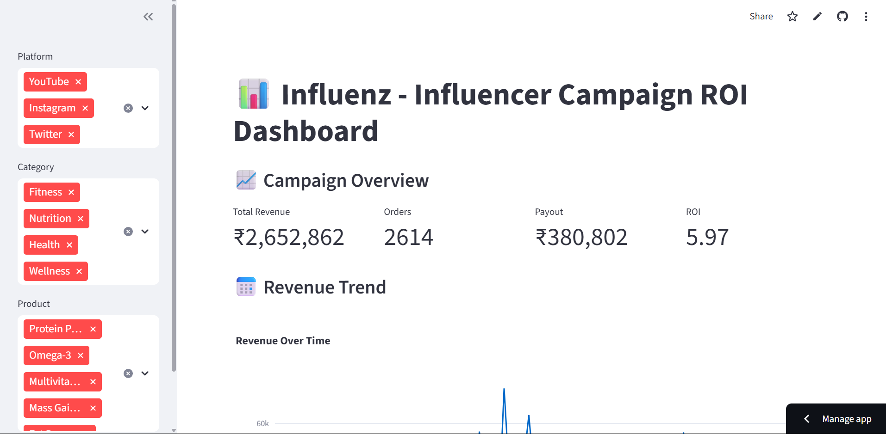

# Influenz – HealthKart Influencer Campaign Dashboard

[🚀 Live Demo](https://healthkart-influencer-dashboard-lqdoavfgnpfqcxz4ugfksh.streamlit.app)

A smart, open-source dashboard to track and visualize influencer marketing performance across platforms like Instagram, YouTube, and Twitter for HealthKart and its brands such as MuscleBlaze, HKVitals, and Gritzo.



---

## 📊 Features

- 📈 **Campaign Insights** — revenue, orders, ROI
- 🧠 **Top Influencer Analytics** — best ROI, most revenue, lowest performers
- 📣 **Post-Level Engagement** — reach vs likes, comment volumes
- 💸 **Payout Tracking** — post-based or order-based, filterable
- 🎛 **Advanced Filtering** — by platform, category, and product
- 📤 **CSV Export** — download filtered tracking data for further analysis
- ⚡ **Responsive UI** — Streamlit + Plotly + Altair

---

## 🛠️ Setup Instructions

```bash
# Clone the repo
git clone https://github.com/your-username/healthkart-influencer-dashboard.git
cd healthkart-influencer-dashboard

# Install dependencies
pip install -r requirements.txt

# Run the Streamlit app
streamlit run app/dashboard.py
```

---

## 🗂 Folder Structure

```
.
├── app/
│   └── dashboard.py              # Streamlit app code
├── data/
│   ├── influencers.csv           # Simulated influencer metadata
│   ├── posts.csv                 # Post-level metrics (reach, likes)
│   ├── payouts.csv               # Payouts (post/order based)
│   └── tracking_data.csv         # Campaign + user revenue data
├── dashbd.png                   # Dashboard screenshot
├── requirements.txt              # All Python dependencies
└── README.md                     # This file
```

---

## 📈 Sample Insights (from sample data)

- **Instagram** had the highest ROAS among all platforms.
- **Protein Powders** generated the most revenue across campaigns.
- Influencers with **Fitness** & **Nutrition** categories performed best.
- Posts with **moderate reach but high engagement** delivered higher ROI.
- Some high-follower influencers had **poor conversion** — indicating the need for better targeting.

---

## 💡 Use Cases

- Marketing ROI tracking
- Influencer performance comparison
- Platform and product-level campaign analysis
- Budget planning & payout estimation

---

## 🔧 Built With

- [Streamlit](https://streamlit.io/)
- [Pandas](https://pandas.pydata.org/)
- [Plotly](https://plotly.com/)
- [Altair](https://altair-viz.github.io/)
- [Faker](https://faker.readthedocs.io/en/master/) (for data simulation)

---

## 📦 Deployment

Deployed via **[Streamlit Cloud](https://streamlit.io/cloud)**.  
URL: [https://healthkart-influencer-dashboard-lqdoavfgnpfqcxz4ugfksh.streamlit.app](https://healthkart-influencer-dashboard-lqdoavfgnpfqcxz4ugfksh.streamlit.app)

---

## 👩‍💻 Author

**Amiti Sharma**  
HealthKart Intern Assignment  

---

## 📃 License

This project is open-source and free to use under the [MIT License](LICENSE).
